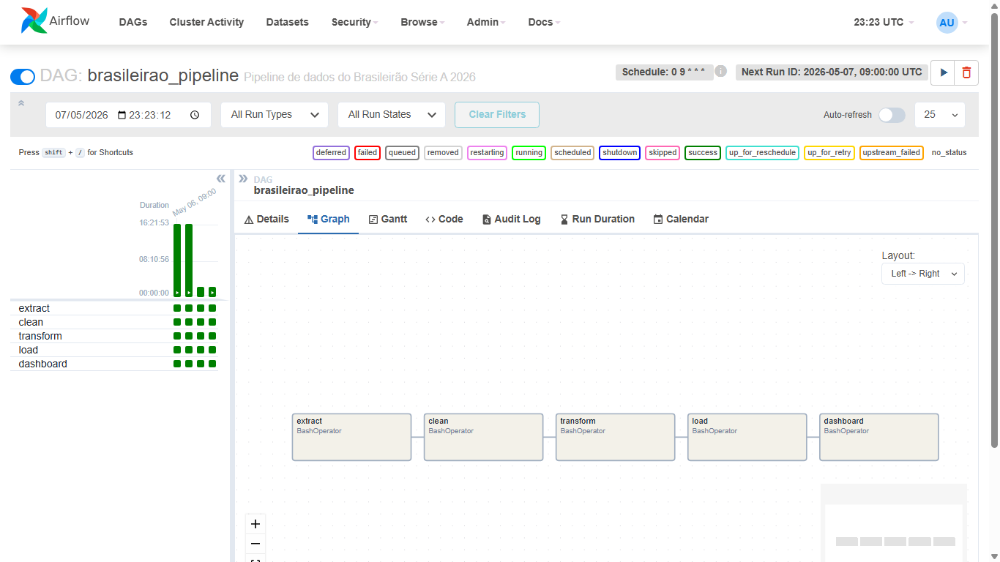
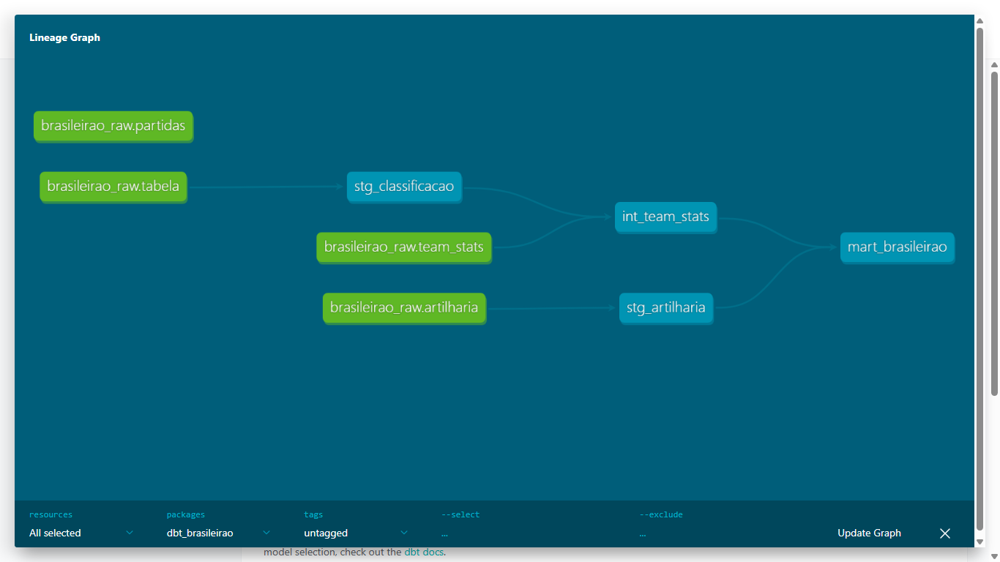
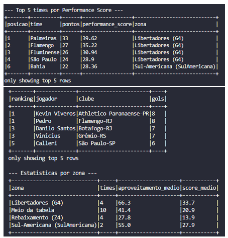

# Brasileirão Série A 2026 - Pipeline V2: Arquitetura de Produção

Essa branch é a evolução do [pipeline original (V1)](https://github.com/MayaraCAlmeida/brasileirao-2026-pipeline/tree/main), construído com Python puro e agendamento via GitHub Actions.

A V2 mantém toda a lógica da V1 e adiciona orquestração com Airflow, transformações modeladas com dbt e processamento distribuído com PySpark, simulando um pipeline de dados em ambiente de produção real.

---

# O que mudou em relação à V1

| Camada | V1 | V2 |
|---|---|---|
| Orquestração | GitHub Actions | Apache Airflow (Docker) |
| Transformações | Python puro | dbt Core (SQL + Jinja) |
| Processamento | pandas | pandas + PySpark |
| Documentação | README | README + dbt docs + lineage graph |

---

# Estrutura da V2

```
brasileirao-2026-pipeline/
│
├── airflow/                        # Orquestração com Apache Airflow
│   ├── docker-compose.yml          # Ambiente completo via Docker
│   ├── Dockerfile
│   └── dags/
│       └── brasileirao_dag.py      # DAG principal do pipeline
│
├── dbt_brasileirao/                # Transformações modeladas com dbt Core
│   ├── dbt_project.yml
│   ├── profiles.yml
│   └── models/
│       ├── staging/                # stg_classificacao · stg_artilharia
│       ├── intermediate/           # int_team_stats
│       └── marts/                  # mart_brasileirao
│
├── spark/                          # Processamento distribuído com PySpark
│   └── transform_spark.py
│
├── docs/                           # Prints das ferramentas em execução
│   ├── airflow-graph.png
│   ├── dbt-lineage.png
│   └── spark-output.png
│
└── [demais arquivos da V1]
```

---

# Orquestração com Apache Airflow

O pipeline é orquestrado por um DAG com 5 tasks em sequência, agendado diariamente às 06:00 BRT com retry automático e backoff exponencial.

```
extract → clean → transform → load → dashboard
```



# Como rodar

## Airflow
```bash
docker compose up -d
```
Acesse em [http://localhost:8080](http://localhost:8080)

## dbt docs (Lineage Graph)
```bash
cd dbt_brasileirao
dbt docs serve --port 8082
```
Ou dê duplo clique em `start_dbt_docs.bat` na raiz do projeto.

Acesse em [http://localhost:8082](http://localhost:8082)

---

# Transformações com dbt Core

A limpeza e padronização dos dados foi modelada em 3 camadas com dbt Core, trazendo testes automáticos e documentação gerada.

| Camada | Model | O que faz |
|---|---|---|
| staging | `stg_classificacao` · `stg_artilharia` | Limpeza e tipagem dos dados brutos |
| intermediate | `int_team_stats` | Agrega métricas por time e calcula performance score em SQL |
| marts | `mart_brasileirao` | Visão analítica final com zona da tabela e artilheiro destaque |

**Como rodar:**

```bash
pip install dbt-postgres
cd dbt_brasileirao/

dbt run --profiles-dir .        # roda todos os models
dbt test --profiles-dir .       # executa os testes de qualidade
dbt docs generate --profiles-dir .
dbt docs serve --profiles-dir . --port 8082
```

Acesse o lineage graph em **http://localhost:8082**.



---

# Processamento distribuído com PySpark

A etapa de feature engineering foi reescrita com PySpark, rodando localmente em modo `local[*]` e pronta para escalar para EMR ou Databricks sem refatoração.

**Transformações realizadas:**
- Cálculo de saldo de gols, média de gols pró e contra por jogo
- Performance score por time (aproveitamento, saldo e ofensividade)
- Classificação por zona da tabela (Libertadores, Sul-Americana, Meio, Rebaixamento)
- Ranking de artilheiros com Window Functions (`rank()`)

**Como rodar:**

No Windows, instale o PySpark em um diretório sem caracteres especiais e rode via PowerShell:

```powershell
pip install pyspark==3.5.1 --target C:\pyspark_clean
$env:PYTHONPATH = "C:\pyspark_clean"
python spark/transform_spark.py
```

No Linux/Mac:

```bash
pip install pyspark==3.5.1
python spark/transform_spark.py
```



---

# Variáveis de ambiente

Copie o `.env.example` e preencha com suas credenciais:

```bash
cp .env.example .env
```

```env
DB_HOST=localhost
DB_PORT=5432
DB_NAME=brasileirao_pipeline
DB_USER=postgres
DB_PASSWORD=sua_senha
```

---

# Arquitetura alvo

```
CBF Website → Scraping → [ Kafka ] → Spark Streaming → PostgreSQL / S3
PDF Oficial → pdfplumber                                      |
                                                              v
                                                   dbt Transformations
                                                   (staging → marts)
                                                              |
                                                              v
                                                        Airflow DAGs
                                                              |
                                                              v
                                                     Dashboard / BI Tool
```

Kafka está posicionado para ingestão em tempo real, útil quando o pipeline evoluir para placares ao vivo.

AWS (roadmap): PostgreSQL local > RDS · CSVs > S3 · Airflow local > MWAA.

---

*Dados extraídos do site oficial da CBF. Projeto independente, sem vínculo com a Confederação Brasileira de Futebol.*

**Desenvolvido por [Mayara C. Almeida](https://github.com/MayaraCAlmeida)**
